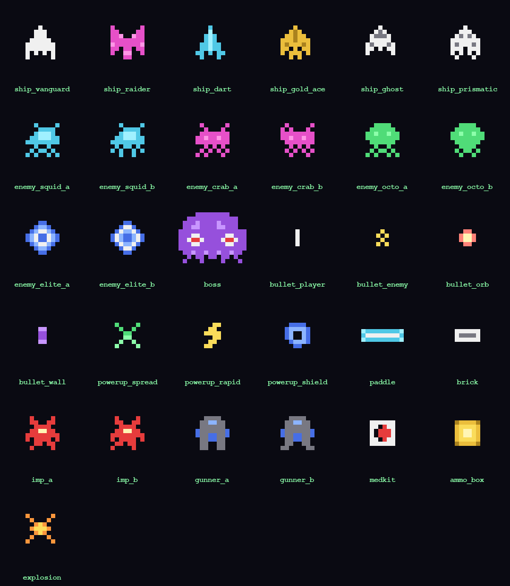

# Pixel Invaders: Voxel Hell

An 8-bit Space Invaders clone that got completely out of hand: a **3D voxel bullet-hell**
rendered with raw OpenGL, with GPU particles, bloom + CRT post-processing, a 5-wave campaign
plus a multi-phase boss, graze scoring, power-ups, achievements, unlockable ships, lifetime
stat tracking, and fully generated chiptune music. Demo/experiment.

Everything is still self-contained: **all art and audio are generated from code** — the pixel
grids in [game/sprites.py](game/sprites.py) are extruded into voxel cube meshes at runtime,
and every sound effect and music loop is synthesized by [tools/gen_sound.py](tools/gen_sound.py)
with nothing but the Python stdlib.


## Play

```powershell
python -m venv .venv
.venv\Scripts\pip install -r requirements.txt
.venv\Scripts\python main.py
```

(macOS/Linux: `python3 -m venv .venv && .venv/bin/pip install -r requirements.txt && .venv/bin/python main.py`.
Requires OpenGL 3.3.)

| Key | Action |
|---|---|
| Arrows / WASD | Move |
| Space (hold) | Autofire |
| **Shift (hold)** | Focus: half speed + show hitbox |
| Enter | Confirm / start |
| Esc | Pause / back |
| C | Toggle CRT filter |
| M | Toggle music |

## How it plays

- **Campaign**: 5 authored waves (aimed fans → radial bursts → spirals → bullet walls →
  everything at once), then the **Dreadnought** — a 3-phase boss with escalating patterns.
- **Graze** enemy bullets (pass close without being hit) to build a score multiplier up to x5.
  Your hitbox is the tiny glowing core, not the whole ship — hold Shift to see it.
- **Power-ups** drop from kills: spread shot, rapid fire, one-hit shield.
- Getting hit clears the screen (mercy rule) and resets your multiplier. 3 lives.
- **12 achievements** unlock **6 ship skins** (browse the Hangar). Lifetime stats, best
  score/wave, unlocks, and settings persist in `profile.json` (atomic writes, survives crashes).

## How it's built

The simulation is pure 2D logic with zero pygame/GL dependencies — the 3D is presentation only.

```
game/    sprites.py (all pixel art as text grids), world.py (bullet-hell sim),
         patterns.py (composable bullet patterns), waves.py, entities.py,
         events.py, skins.py
meta/    profile.py (versioned atomic JSON save), stats.py, achievements.py
render/  voxel.py (grid -> face-culled cube mesh, GL instancing), particles.py
         (numpy sim, instanced cubes), post.py (bloom + CRT + shake/aberration),
         text.py (font-texture HUD), gl.py, renderer.py
tools/   gen_art.py (bakes PNGs + contact sheet from the grids),
         gen_sound.py (synthesizes every sfx + two music loops, stdlib-only),
         test_world.py / test_meta.py / smoke_test.py / test_render.py
main.py  app state machine: menu, hangar, achievements, stats, gameplay
```

Rendering: each entity is drawn by instancing its voxel mesh (12 floats per instance:
position/scale/quaternion/tint); bullets and thousands of particles ride the same path, so the
whole scene is a handful of draw calls. Scene renders to a float FBO where emissive tints
exceed 1.0, gets a bright-pass + separable gaussian bloom at half res, then a CRT composite
(scanlines, vignette, barrel distortion, chromatic aberration pulses on hits).



## Tests

All headless — the sim runs without a window and the renderer runs against a hidden GL context:

```powershell
.venv\Scripts\python tools\test_world.py    # bot plays the full campaign; determinism; loss path
.venv\Scripts\python tools\test_meta.py     # achievements/stats/profile round-trip
.venv\Scripts\python tools\smoke_test.py    # boots the real app, drives every screen
.venv\Scripts\python tools\test_render.py   # offscreen render, writes screenshots
```

Regenerate assets after editing sprite grids or sound definitions:

```powershell
.venv\Scripts\python tools\gen_art.py
.venv\Scripts\python tools\gen_sound.py
```

> **Why pygame-ce?** Plain `pygame` doesn't publish wheels for very new Python releases;
> `pygame-ce` is the API-compatible community fork that does (`import pygame` still works).

This is a demo/experiment repo, not a production project.
