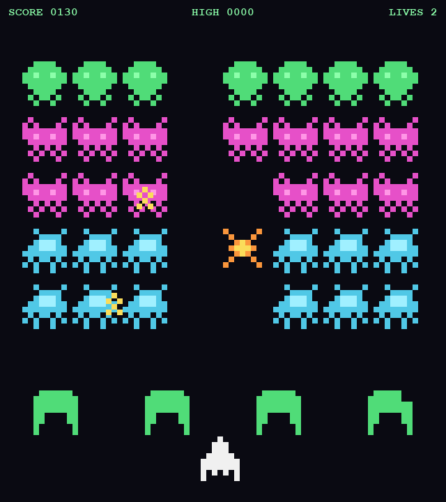
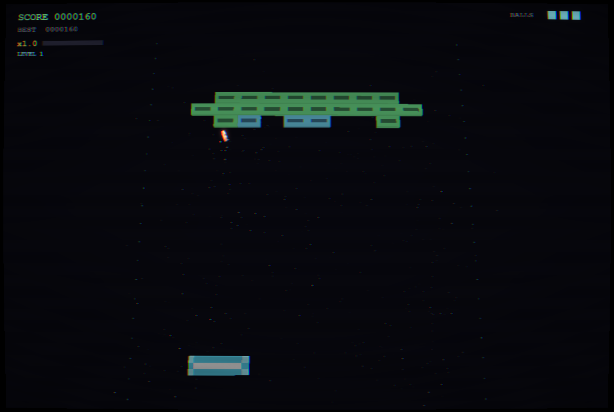
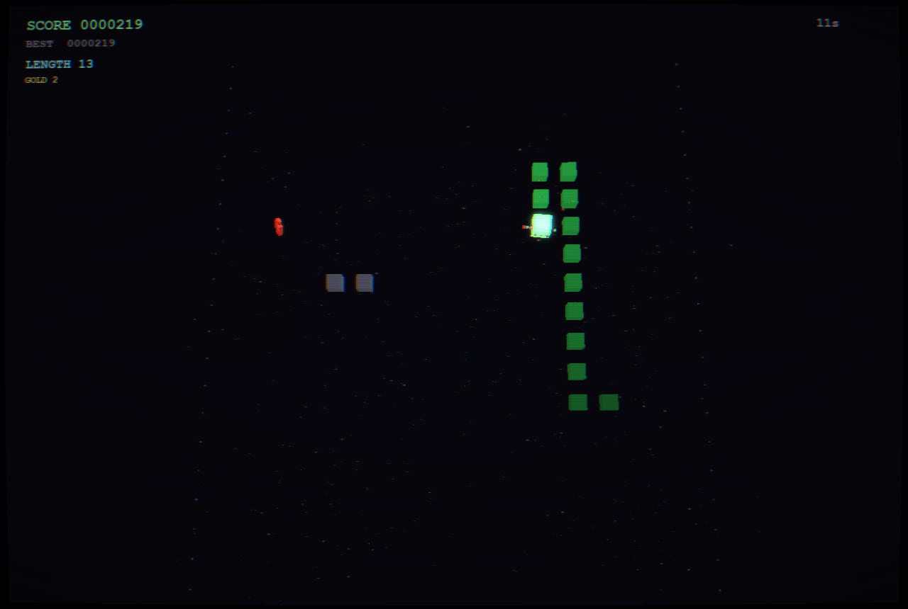
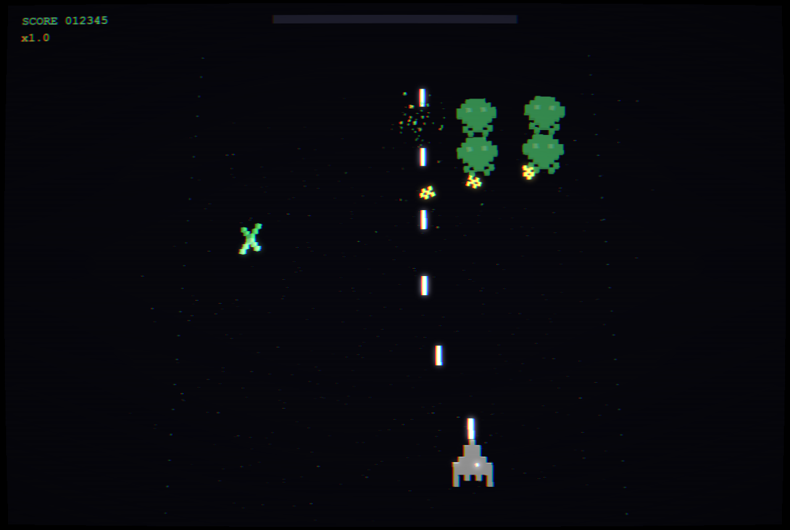
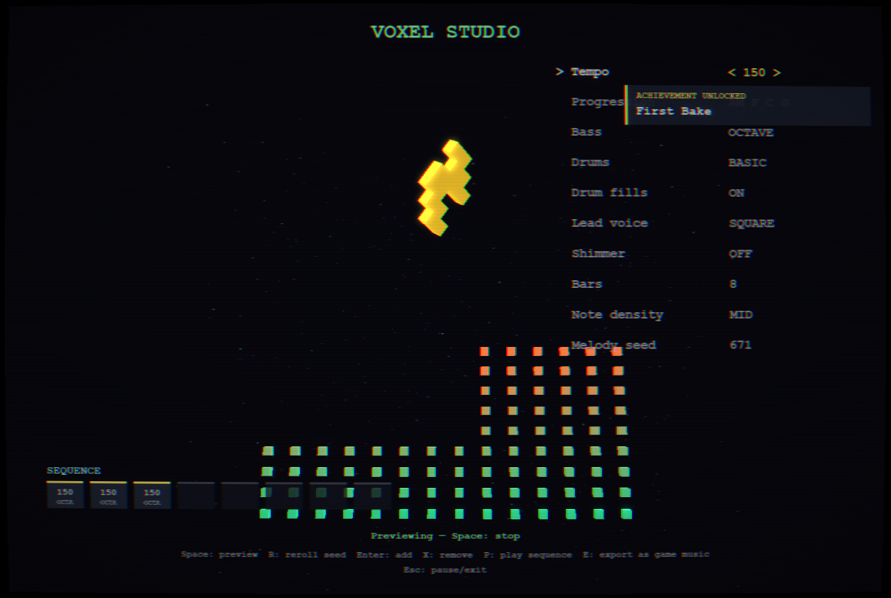

# Pixel Invaders Arcade

A multi-game **8-bit voxel arcade cabinet** in Python: three enhanced classics rendered with
raw OpenGL (voxel sprites, GPU particles, bloom + CRT post-processing), with achievements,
unlockable ships, attract mode, initials entry, local + **global leaderboards**, and a
Dockerized backend microservice for the global scores. Demo/experiment that got gloriously
out of hand.

**Look & feel — Emberlight.** The whole cabinet is lit like firelight against a warm dark.
One shared palette holds it together — **ember** for score and confirms, **cream** text,
**honey** highlights — while each game claims its own signature accent from that same set, so
they feel individual without drifting apart: Voxel Hell → cosmos **iris**, Voxel Breaker →
crystal **lagoon**, Voxel Serpent → garden **fern**, Voxel Doom → hell **garnet** (with a warm
doorway of light for the exit), Voxel Crisis → dusk **copper**, Voxel Aim → cool **frost** (so
its warm targets pop), Voxel Studio → creative **bloom**. It's all one file:
[game/theme.py](game/theme.py). *(Screenshots below predate the theme.)*

Everything is generated from code — the pixel grids in [game/sprites.py](game/sprites.py)
become voxel meshes at runtime, and every sound effect and all music is synthesized by
[tools/gen_sound.py](tools/gen_sound.py) with only the Python stdlib. The soundtrack isn't
a loop: a seeded procedural composer bakes a bank of interlocking chiptune sections (varied
progressions, melodies, bass styles, drum patterns, intensity tiers) and the game chains
them gaplessly in shuffled order — with a separate high-tension pool that takes over during
boss fights.

| | |
|---|---|
|  |  |
| **Voxel Hell** — bullet-hell invaders | **Voxel Breaker** — brick demolition |
|  |  |
| **Voxel Serpent** — glowing snake | Voxel Hell, wave combat |

## The games

Two categories on the cabinet menu (Left/Right on the CATEGORY row):

**CLASSICS +**
- **Voxel Hell** — bullet-hell invaders. Campaign (5 waves + 3-phase boss, then endless
  harder **loops**) and procedural **endless** mode with a boss every 5th sector. Focus
  movement, graze-for-multiplier scoring, power-ups, 14 achievements, 6 unlockable ship
  skins in the Hangar.
- **Voxel Breaker** — paddle/ball brick demolition with a combo multiplier, 5 authored
  levels that loop armored, multi-ball/wide/laser power-ups, 8 achievements.
- **Voxel Serpent** — grid snake with a speed curve, rare gold fruit, obstacle walls that
  grow with your appetite, 6 achievements.

**FPS**
- **Voxel Doom** — first-person dungeon shooter: three floors of instanced-voxel corridors,
  imps and gunners with line-of-sight AI, hitscan pistol (fists when dry), medkits and ammo,
  a pixel gun viewmodel with bob/kick/muzzle flash. Mouse-look to turn, WASD to move and
  strafe (arrows/right-stick also turn), and a proper metal soundtrack.
- **Voxel Crisis** — on-rails cover shooter: the camera rides six zones, troopers pop from
  cover with telegraphed shots, **duck with Shift to dodge and reload** your 8-round clip,
  quick-kill bonuses, and the Dread Captain at the end. Mouse aim.
- **Voxel Aim** — gridshot aim trainer: 60-second score attack with combo multiplier,
  accuracy and reaction-time stats. Mouse aim.
- **Voxel Studio** — the cabinet's music workstation. Every property of the composition
  engine is editable (tempo, chord progression, bass style, drum kit + fills, lead voice,
  shimmer, bars, note density, melody seed), with live preview against a voxel equalizer.
  Arrange baked sections into an 8-slot sequence and **export it as the actual in-game
  soundtrack** (`Settings -> Game music: CUSTOM`, or it flips automatically on export).
  Sequences persist in your profile; exports land in `usermusic/` as a `custom` music pool.



Adding a game = one folder under `games/` implementing the small interface in
[arcade/game_api.py](arcade/game_api.py) plus a registry line.

## Play (Windows / macOS / Linux)

```bash
python -m venv .venv
# Windows:  .venv\Scripts\pip install -r requirements.txt && .venv\Scripts\python main.py
# mac/linux: .venv/bin/pip install -r requirements.txt && .venv/bin/python main.py
```

Requires OpenGL 3.3 (works on macOS's deprecated-but-functional GL stack; the forward-compat
core-profile flag is set automatically). Gamepads supported (Xbox-style layout). `--kiosk`
boots fullscreen straight into attract mode.

| Key | Action |
|---|---|
| Arrows / WASD / stick | Move + menu navigation |
| Space / A button (hold) | Fire |
| Shift / shoulders | Focus (Voxel Hell), slow paddle (Breaker) |
| Enter / Start | Confirm |
| Esc / B | Pause / back |
| C / M | CRT filter / music |

**Settings** (persisted): FPS cap 60–240/unlimited, vsync, fullscreen, bloom quality,
particle density, CRT, volumes, FPS counter. **Attract mode** starts after 15s idle on the
menu — a bot plays the cabinet's games until you press something. Qualifying scores get
3-letter **initials entry** into local top-10 boards per game/mode.

## Multiplayer

With the backend deployed (see [DEPLOY.md](DEPLOY.md)), every scored game gains a
**MULTIPLAYER** menu entry: host a session (pick the mode, get a 4-letter code) or join
with a code. Everyone in the session plays **the same seeded run** — identical waves,
levels, and spawns — and scores post to a live lobby standings board. Async by design:
race now, let family beat your score after dinner. Sessions expire after 24h.

## Global leaderboards (the microservice)

`server/` is a self-contained FastAPI + SQLite service the desktop game talks to over HTTP
(fully optional — the game degrades gracefully offline):

- `POST /api/v1/scores` — validated score submission (optional `X-Api-Key`)
- `GET /api/v1/scores?game=&mode=` — top N as JSON (CORS-enabled for your website)
- `GET /scoreboard?game=&mode=` — **self-contained retro HTML scoreboard**, made to be
  iframed into a family website: `<iframe src="http://your-box:8083/scoreboard?game=voxelhell&mode=campaign" width="500" height="640" frameborder="0"></iframe>`
- `GET /api/v1/daily` — deterministic daily seed (future daily-challenge mode)
- `GET /healthz` — container healthcheck

### Deploy on the Ubuntu box

CI (GitHub Actions) tests and publishes the image to GHCR on every `server/**` change; the
package inherits this repo's **private** visibility. One-time on the box:

```bash
# PAT needs read:packages
echo $GITHUB_PAT | docker login ghcr.io -u <your-github-user> --password-stdin
```

Then, with [docker-compose.yml](docker-compose.yml) copied over (or the repo cloned):

```bash
docker compose pull && docker compose up -d     # or: docker compose up -d --build
curl http://localhost:8083/healthz
```

Scores live in the `arcade-data` volume. Optional env: `ARCADE_API_KEY` (require a key for
submissions; set `PIXEL_INVADERS_API_KEY` in the game's environment to match) and
`ARCADE_CORS_ORIGINS` (lock browser reads to `https://chomey.org`).

### Point the game at it

Set `settings.server_url` in `profile.json` (e.g. `"http://ubuntu-box:8083"`) or the
`PIXEL_INVADERS_SERVER` env var. The SCORES screen gains a LOCAL/GLOBAL toggle and initials
submissions upload automatically (with a global-rank toast).

## How it's built

The simulations are pure logic (no pygame/GL) — 3D is presentation only.

```
arcade/    game_api.py — the cabinet<->game contract
games/     voxelhell/ breaker/ serpent/ — world sim, drawing, HUD,
           achievements, demo bot per game; __init__.py registry
game/      shared engine: sprites (pixel grids), entities, events,
           audio bank, net client, theme (Emberlight palette)
meta/      profile (versioned atomic JSON, v1->v2 migration), stats,
           achievements engine, local leaderboards
render/    generic voxel scene engine: instanced meshes, numpy particles,
           bloom + CRT + letterboxed composite, font-texture overlay
server/    FastAPI microservice: own requirements, tests, Dockerfile
main.py    cabinet shell: carousel menu, attract, initials, screens
tools/     asset generators + five test suites
```

## Tests (all headless)

```bash
python tools/test_world.py        # Voxel Hell: campaign loops, endless, determinism
python tools/test_games.py        # Breaker + Serpent sims, bots, determinism
python tools/test_meta.py         # stats/achievements/skins, profile migration
python tools/smoke_test.py        # boots the real cabinet, plays every game
python server/test_server.py      # API tests (needs: pip install httpx)
python tools/test_integration.py  # real uvicorn server + the game's net client
```

Regenerate assets after editing sprite grids or sound definitions:
`python tools/gen_art.py && python tools/gen_sound.py`

> **Why pygame-ce?** Plain `pygame` doesn't publish wheels for very new Python releases;
> `pygame-ce` is the API-compatible community fork that does (`import pygame` still works).

Demo/experiment repo. macOS is written-for but untested — file an issue at me.
